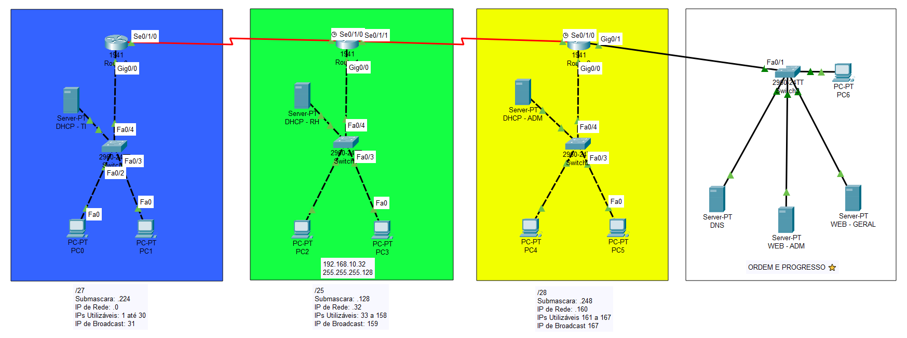
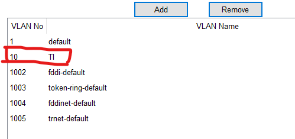
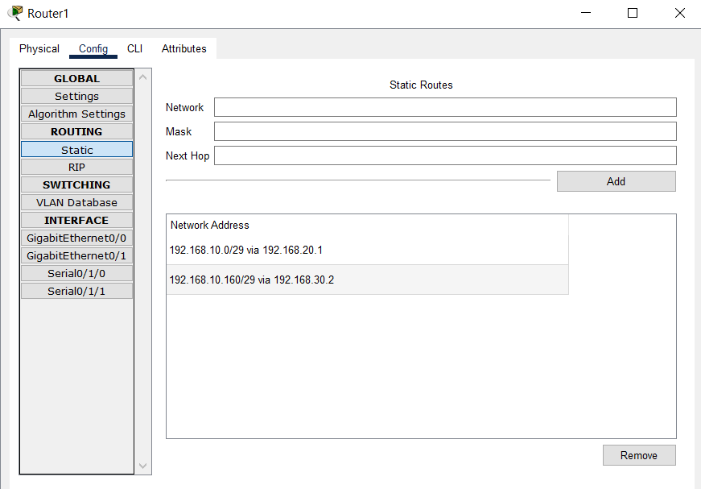
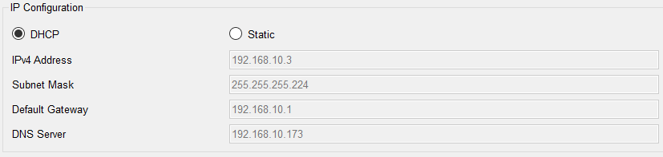
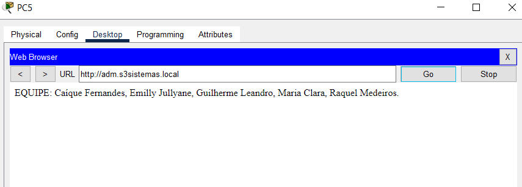

# Projeto de Configuração de uma Rede Empresarial

O seguinte projeto faz parte da avaliação final da disciplina de GERE (Gerência de Redes)

## Índice
- [Tecnologias utilizadas](#tecnologias-utilizadas)
- [Divisão de tarefas](#divisão-de-tarefas)
- [Desenvolvimento](#desenvolvimento)
    - [Planejamento da Rede](#planejamento-da-rede)
    - [Configuração dos Equipamentos de Rede](#configuração-dos-equipamentos-de-rede)
    - [Testes](#testes)
- [Dificuldades encontradas](#dificuldades-encontradas)
- [Equipe](#equipe)

---

## Tecnologias utilizadas
- Cisco Packet Tracer
- Git para versionamento

## Divisão de Tarefas
A equipe organizou as atividades de maneira dinâmica, dividindo as tasks de acordo com a especialidade e interesse de cada integrante. As decisões sobre a alocação das tasks foram tomadas em conjunto, mantendo uma comunicação constante para apoiar qualquer dificuldade em cada etapa.

Vale ressaltar que, embora as tasks tenham sido divididas para fins de organização, todos participaram de cada fase do projeto, pois cada task dependia da subsequente.

## Desenvolvimento
### Planejamento da Rede
- Definir o esquema de endereçamento IP e a topologia da rede 
A topologia usada foi o barramento

- Especificar o equipamento utilizado (modelos de switches e roteadores) 
    - 3 Roteadores 1941 
    - 4 switches 2960-24TT

- Dividir a rede em sub-redes, calculando IPs de acordo com o número de hosts necessários
- Documentar cada sub-rede, incluindo IP de rede, intervalo de IPs válidos, broadcast e máscara no formato padrão

 

### Configuração dos Equipamentos de Rede
- Configurar os switches para suportar VLANs

Foi criada uma VLAN para cada switch de cada subrede. O de TI, por exemplo, ficou com a VLAN 10 como mostra a imagem abaixo, e os de RH e ADM ficaram com VLAN 20 e 30.

 

- Configurar o roteador para roteamento inter-VLAN e, se possível, conceder acesso à Internet

Abaixo pode-se ver a configuração do Router da Rede Verde, conectando ele com as roteadores da Rede Amarela e da Rede Azul.

No arquivo `.pkt` encontrado no repositório podem ser vistas as configurações de seus vizinhos.

- Configurar os servidores DHCP, DNS e Web para atender à demanda da rede

Todos foram devidamente configurados e funcionam corretamente, as configurações específicas podem ser observadas no arquivo `.pkt` encontrado no repositório.

### Testes
- Testar a conectividade entre VLANs e a comunicação entre servidores 
    - As conexões entre VLANs vizinhas e entre servidores estão funcionando corretamente, o único problema encontrado foi na conexão entre VLANs distantes.
- Verificar se o DHCP está distribuindo IPs corretamente 
    - Sim, conforme o exemplo da Rede Azul:

    

- Testar a resolução de nomes via DNS e o acesso ao servidor Web
    - Funcionando, conforme exemplo:

## Dificuldades encontradas

- Aproveitamento baixo matéria RDC1, dificultando o entendimento geral da matéria;
- Carga Horária reduzida devido a greve e excesso de sábados letivos, dificultando as práticas no software usado;
- Dificuldade na configuração dos roteadores e problemas ao conectar com os switches.

## Equipe
<table align="center">
  <tr align="center">
  <td>
      <a href="https://github.com/Caiqueferlima">
        
        
Caíque  Fernandes

      </a>
    </td>
    <td>
      <a href="https://github.com/emillyjullyane">
        
        
Emilly  Jullyane

      </a>
    </td>
    <td>
      <a href="https://github.com/Guilhermeleandro-N">
        
        
Guilherme  Leandro

      </a>
    <td>
      <a href="https://github.com/mcclara18">
        
        
Maria  Clara

      </a>
    </td>
    <td>
      <a href="https://github.com/Rachelee18">
        
        
Raquel  Medeiros

      </a>
  </tr>
